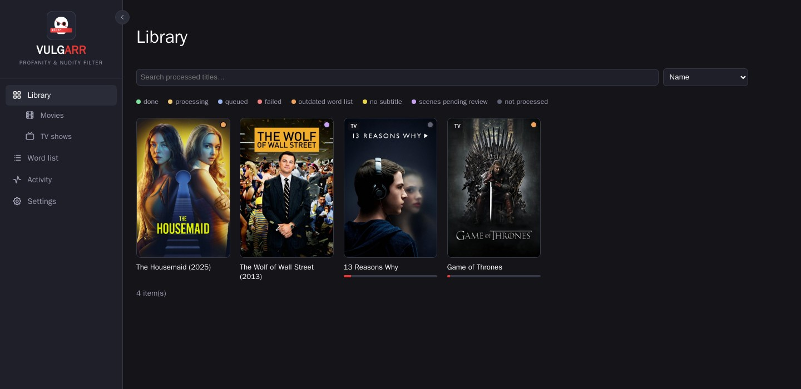
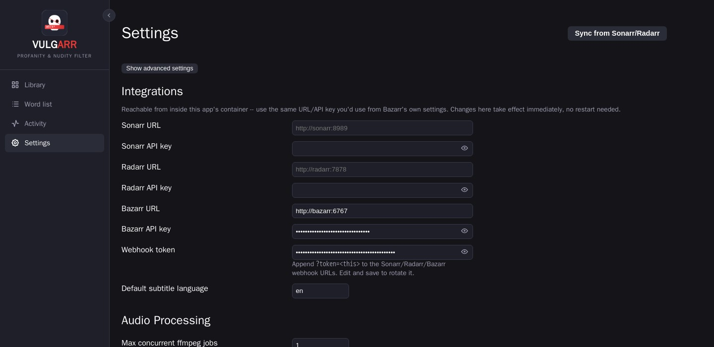

<p align="center">
  
</p>

<h1 align="center">Vulgarr</h1>
<p align="center">A self-hosted, Radarr/Sonarr-styled profanity &amp; nudity filter for your Plex/Jellyfin library.</p>

Vulgarr runs two independent pipelines against your library:

- **Audio**: adds a second, selectable **"Clean"** audio track to movies and
  episodes by muting the audio under profane subtitle cues. Detection is
  subtitle-based (matches an `.srt` against a configurable, severity-tagged
  word list) — never ASR/transcription. The original audio track's bytes are
  never touched; a verified copy with the new track atomically replaces the
  file on disk, and the original is always kept as a timestamped backup.
- **Video**: scans for candidate nudity/sex scenes using a local frame
  classifier, queues them for a quick manual approve/reject in the UI (or
  auto-approves, if you turn that on), then produces a separate **"Vulgarr
  Edit"** copy of the file with those scenes blurred and optionally muted —
  the original file is never modified. An optional Claude Vision pass can
  double-check candidates before auto-approving, to catch false positives a
  frame classifier alone tends to flag (e.g. ordinary swimwear).

Both pipelines are entirely opt-in per title/season/show and run
independently of each other. Built to sit alongside an existing
Sonarr/Radarr/Bazarr/Plex/Jellyfin stack and stay out of the way: it watches
for new imports, does its thing, and the results just show up as extra
selectable tracks/files your player already knows how to handle.

## Screenshots

| Library | Settings |
|---|---|
|  |  |

| Activity queue | Word List |
|---|---|
|  |  |

## How the audio pipeline works

1. **Parse** the episode/movie's `.srt` (`app/subtitles/parser.py`) into timed cues, stripping HTML/ASS-style tags and normalizing line breaks.
2. **Match** each cue's text against the word list (`app/subtitles/matcher.py`) — case/punctuation-insensitive, whole-word by default, severity-tagged (Child/Teen).
3. **Build mute intervals** from matched cues (`app/audio/mute.py`) with small padding and merging of close cues.
4. **Remux** (`app/mux/remux.py`): ffmpeg stream-copies every existing stream (video, original audio, subtitles, chapters) untouched and appends one new AAC audio track with a `volume=0` filter gated to the mute intervals, tagged `title=Clean`. The result is verified (stream count, duration, and a real decode of the new track) in a temp file before anything touches the original. Only then is the original moved to `/data/backups/<relative path>.<timestamp>.orig` and the verified file atomically swapped into place.

Because this is stream-copy plus one small filtered audio track, most of a
file's bytes are literally copied, not re-encoded — fast, and no quality
loss on video/original audio.

## How the video pipeline works

Entirely separate feature, entirely manual to start (never runs on import —
only from an explicit "Scan for scenes" click, since a scan has a real CPU
cost and Apply produces a full second encoded copy of the file):

1. **Scan** (`app/vision/classifier.py`): samples frames from the video at a
   configurable interval and classifies each with a local, self-hosted model
   (no data leaves your machine for this step) — no ASR/subtitles involved,
   this is purely a visual classifier.
2. **Cluster** (`app/vision/scene_cluster.py`): merges nearby hits into
   candidate scenes, then does a second, denser re-scan of just each
   candidate's padded window to refine its actual start/end and compute a
   confidence stat used for one-click bulk-approval later.
3. **Review**: candidates land in a per-title review queue — approve, reject,
   or adjust each one's boundaries by hand. Optionally, turn on **auto-approve**
   to skip this and have high-confidence scans approve themselves, and/or the
   **Claude Vision precision filter** (`app/vision/claude_verify.py`) to send
   a few frames per candidate to any OpenAI-compatible vision endpoint (e.g. a
   self-hosted [LiteLLM](https://github.com/BerriAI/litellm) proxy in front of
   Anthropic's API) for a second opinion before auto-approving — this is the
   one thing in Vulgarr that costs real external money per use (a fraction of
   a cent per scan), and it's off by default.
4. **Apply** (`app/mux/scene_blur.py`, `app/scenes/pipeline.py`): re-encodes
   just the approved windows with a boxblur (adjustable intensity, with a live
   preview in Settings) and optionally mutes their audio too, producing a
   sibling **"Vulgarr Edit"** file — the original is never touched. Re-running
   Apply after approving/rejecting more scenes always rebuilds from whatever's
   currently approved.

## Features

- Poster-grid library views for movies and TV shows, synced from Sonarr/Radarr, with live search and sort
- Per-title, per-season, and per-show severity levels (Child / Teen), with whole-line or precise (word-position estimate, or Whisper forced-alignment) mute modes
- Configurable, versioned word list with severity tagging and whole-word matching
- Local, self-hosted nudity/sex-scene detection with a manual review UI, optional auto-approve, and an optional Claude Vision precision filter
- Automatic triggers from Sonarr/Radarr import webhooks, Bazarr's subtitle-downloaded event, and/or per-title Radarr/Sonarr tags (`vulgarr-audio`/`vulgarr-video`/`vulgarr-both`, e.g. via Overseerr's Advanced Request tag picker)
- Consolidated activity queue (In Progress / Completed) spanning both pipelines, with live progress, concurrency limits, and an off-hours processing window
- Backup retention policy for original files under `/data/backups`
- Optional HTTP Basic Auth in front of the whole UI
- Runs as any PUID/PGID so files it creates match your host user

## Local dev

```bash
pip install -r requirements.txt
SPF_DATA_DIR=./data SPF_MEDIA_ROOT=./data uvicorn app.main:app --reload
```

Run tests:

```bash
pytest tests/ -q
```

## Quick start

```bash
git clone https://github.com/dpresti/vulgarr.git
cd vulgarr
cp .env.example .env
# edit .env for your setup, then:
docker compose up -d --build
```

Then open `http://<host>:<SPF_PORT>/library` (default port `8011`).

## Wiring into an existing Sonarr/Radarr/Bazarr/Plex/Jellyfin stack

1. **Compose**: [`docker-compose.yml`](docker-compose.yml) joins the same Docker network your Sonarr/Radarr/Bazarr containers are on (`media_default` by default — rename to match yours) so it's reachable from them by container name. Set these in `.env` (copy from [`.env.example`](.env.example); `.env` itself is never committed — see `.gitignore`):
   - `MEDIA_ROOT_HOST_PATH` / `SPF_MEDIA_ROOT` — the host path and matching **container-side** path for your media, which must be the exact same container-side path your Sonarr/Radarr containers already use (this app resolves file paths returned by their APIs directly, so a mismatch means it won't find files that exist). Once you've synced titles, don't change the container-side path later — it's baked into every stored path in the database.
   - `SPF_DATA_DIR` — where the SQLite DB and backups live on the host.
   - `SPF_PORT` — host port to publish the UI on (defaults to 8011).
   - `PUID` / `PGID` — the host user/group (`id -u` / `id -g`) that should own files this container creates under `SPF_DATA_DIR` and your media mounts. Defaults to 1000/1000; set these if your host user is different, otherwise you'll get permission-mismatched files.

2. **API keys**: each of Sonarr/Radarr/Bazarr has its own API key, generated by that app, under **that app's own** Settings > General > Security page (not Vulgarr's Settings) — copy it from there into `SONARR_API_KEY` / `RADARR_API_KEY` / `BAZARR_API_KEY` in Vulgarr's `.env`. Also set `SPF_WEBHOOK_TOKEN` to a random string (or leave it unset — a random one is generated automatically on first run rather than leaving webhooks unauthenticated). These `.env` values are only used to *seed* Vulgarr's database on first startup — from then on, all of them (including rotating the webhook token) are editable from Vulgarr's own **Settings > Integrations** page in the UI, no `.env` edit or restart required. Append `?token=<that value>` to the webhook URLs below, using whatever the token currently is in Vulgarr's Settings.

3. **Sonarr**: in **Sonarr's own UI**, go to Settings > Connect > add a Webhook connection. URL: `http://vulgarr:8000/webhooks/sonarr?token=<token>`. Trigger on: *On Import*, *On Upgrade*.

4. **Radarr**: same as Sonarr, in **Radarr's own UI** — Settings > Connect > add Webhook, URL: `http://vulgarr:8000/webhooks/radarr?token=<token>`.

5. **Bazarr**: in **Bazarr's own UI**, go to Settings > Subtitles > Custom Post-Processing. Enable it, and set the command to a `curl` call using Bazarr's template variables, e.g.:
   ```
   curl -s -X POST "http://vulgarr:8000/webhooks/bazarr?token=<token>&video_path={{directory}}/{{episode}}&subtitle_path={{subtitles}}&language={{subtitles_language_code2}}"
   ```
   (Bazarr's exact variable names vary by version — check Bazarr's own Settings > Subtitles > Custom Post-Processing page for the list available in your version and adjust.) Then flip "Bazarr subtitle-downloaded event" on in **Vulgarr's** Settings page if you want this trigger active.

6. **First run**: open `http://<host>:<SPF_PORT>/settings` and click "Sync from Sonarr/Radarr" to pull in the existing library (this only reads metadata/paths via the Sonarr/Radarr APIs — it does not process anything). Then check `/library/movies` or `/library/shows` to see the synced titles, and go to `/wordlist` to build out your word list before processing anything for real. Scene detection needs no separate setup — it's manual-start per title/season/show from the library, with its own tuning under Settings > Video Processing if you want it.

7. **Plex/Jellyfin**: nothing to configure — once a title has been audio-processed, refresh/rescan that item's metadata (or wait for the next library scan) and the "Clean" audio track will appear in the audio track picker like any other track. A "Vulgarr Edit" from the video pipeline shows up as a separate playable file/version, same as any other extra cut Plex/Jellyfin already knows how to list.

## Settings reference

The Settings page is grouped into sections (Integrations, Audio Processing,
Video Processing, Backups, Authentication), with a "Show advanced settings"
toggle hiding the finer classifier/encode-tuning knobs by default:

- **Integrations** — Sonarr/Radarr/Bazarr URLs+API keys, the webhook token, default subtitle language, and the clean track's title/language tag. Editable here at any time; `.env` only supplies the first-run defaults.
- **Audio Processing** — max concurrent ffmpeg jobs, off-hours processing window, automation triggers (independently enable/disable Sonarr/Radarr import and Bazarr's subtitle-downloaded event, and which one takes priority for de-duplication), and the default mute precision for newly-synced titles.
- **Video Processing** — auto-approve/auto-process toggle, the optional Claude Vision precision filter (base URL/API key/model, off by default), classifier tuning (confidence threshold, frame sample interval, scene duration/merge-gap, concurrency), blur quality/speed/intensity with a live preview, and blur/mute padding around each approved scene.
- **Backups** — retention (in days) for files under `/data/backups`; defaults to 7, 0 keeps every backup forever.
- **Authentication** — optional HTTP Basic Auth in front of the entire UI (**off by default**). Turn this on if the app is reachable by anyone besides you — e.g. exposed outside your LAN — since nothing here is protected otherwise, including the Sonarr/Radarr/Bazarr API keys visible on this same Settings page. Sonarr/Radarr/Bazarr's webhook calls are always exempt (they carry their own `?token=`, not a login). Note: Basic Auth alone doesn't protect against CSRF (browsers resend cached credentials on cross-site requests) — fine for a trusted LAN, but if you're exposing this beyond that, put it behind a reverse proxy/VPN rather than relying on Basic Auth as your only barrier.

## Notes / known trade-offs

- Backups accumulate under `/data/backups` for 7 days by default (Settings > Backups); set it to 0 to keep every backup forever instead.
- `backup_root` (`/data/backups`) should ideally be on the same filesystem as your media mount; otherwise the "move original aside" step becomes a slower copy+delete instead of an instant rename.
- Subtitle matching mutes the whole subtitle cue's time range (padded slightly) by default — a plain `.srt` has no word-level timestamps of its own. Settings > Audio Processing has two opt-in, narrower alternatives: `estimate` (a proportional guess based on the word's position in the cue's text) and `whisper` (real word-level forced alignment against the actual audio, not a guess).
- Scene detection is a classifier, not a certainty — it's tuned to prefer false positives over missed scenes, since every candidate goes through human review (or Claude Vision, if enabled) before anything is blurred, unless you turn auto-approve on.
- There's no per-user accounts/roles — Settings > Authentication is a single shared username/password (or nothing) in front of the whole app, not a multi-user system.

## License

[GPL-3.0](LICENSE)
