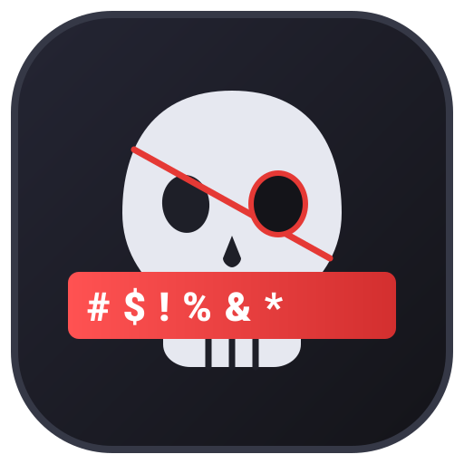
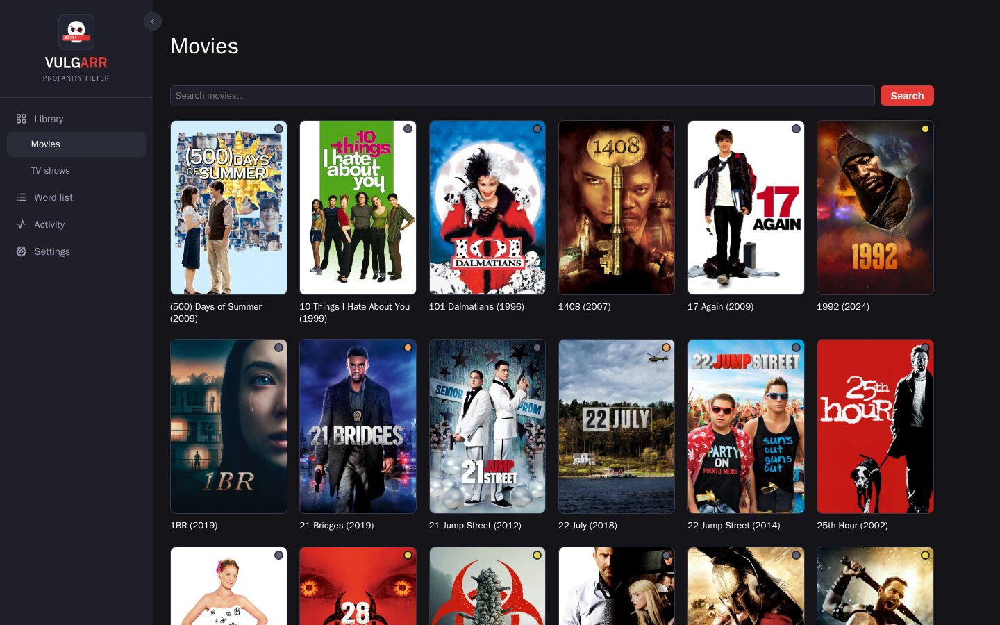
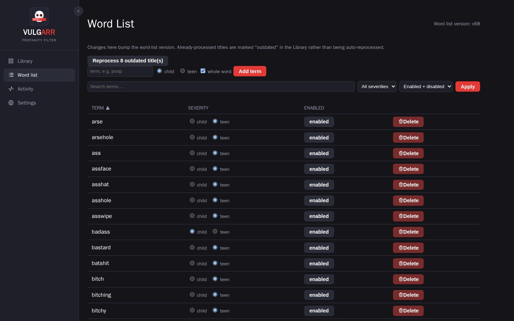
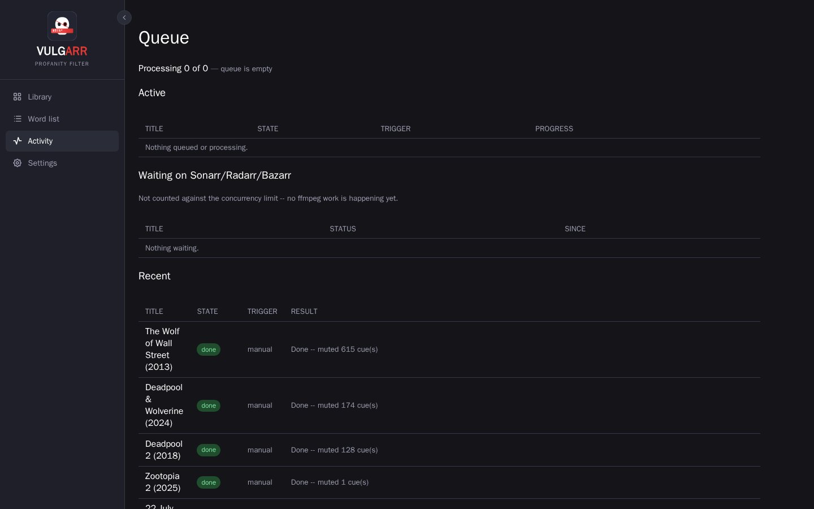

<p align="center">
  
</p>

<h1 align="center">Vulgarr</h1>
<p align="center">A self-hosted, Radarr/Sonarr-styled profanity filter for your Plex/Jellyfin library.</p>

Vulgarr adds a second, selectable **"Clean"** audio track to movies and
episodes by muting the audio under profane subtitle cues. Detection is
subtitle-based (matches an `.srt` against a configurable, severity-tagged
word list) — never ASR/transcription. The original audio track's bytes are
never touched; a verified copy with the new track atomically replaces the
file on disk, and the original is always kept as a timestamped backup.

Built to sit alongside an existing Sonarr/Radarr/Bazarr/Plex/Jellyfin stack
and stay out of the way: it watches for new imports, does its thing, and the
"Clean" track just shows up in your player's audio menu.

## Screenshots

| Library | Word List |
|---|---|
|  |  |

| Activity queue |
|---|
|  |

## How it works

1. **Parse** the episode/movie's `.srt` (`app/subtitles/parser.py`) into timed cues, stripping HTML/ASS-style tags and normalizing line breaks.
2. **Match** each cue's text against the word list (`app/subtitles/matcher.py`) — case/punctuation-insensitive, whole-word by default, severity-tagged (Child/Teen).
3. **Build mute intervals** from matched cues (`app/audio/mute.py`) with small padding and merging of close cues.
4. **Remux** (`app/mux/remux.py`): ffmpeg stream-copies every existing stream (video, original audio, subtitles, chapters) untouched and appends one new AAC audio track with a `volume=0` filter gated to the mute intervals, tagged `title=Clean`. The result is verified (stream count, duration, and a real decode of the new track) in a temp file before anything touches the original. Only then is the original moved to `/data/backups/<relative path>.<timestamp>.orig` and the verified file atomically swapped into place.

Because this is stream-copy plus one small filtered audio track, most of a
file's bytes are literally copied, not re-encoded — fast, and no quality
loss on video/original audio.

## Features

- Poster-grid library views for movies and TV shows, synced from Sonarr/Radarr
- Per-title and per-season severity levels (Child / Teen), with whole-line or precise mute modes
- Configurable, versioned word list with severity tagging and whole-word matching
- Automatic triggers from Sonarr/Radarr import webhooks and/or Bazarr's subtitle-downloaded event
- Activity queue with live progress, concurrency limits, and an off-hours processing window
- Backup retention policy for original files under `/data/backups`
- Optional HTTP Basic Auth in front of the whole UI
- Runs as any PUID/PGID so files it creates match your host user

## Local dev

```bash
pip install -r requirements.txt
SPF_DATA_DIR=./data SPF_MEDIA_ROOT=./data uvicorn app.main:app --reload
```

Run tests:

```bash
pytest tests/ -q
```

## Quick start

```bash
git clone https://github.com/dpresti/vulgarr.git
cd vulgarr
cp .env.example .env
# edit .env for your setup, then:
docker compose up -d --build
```

Then open `http://<host>:<SPF_PORT>/library` (default port `8011`).

## Wiring into an existing Sonarr/Radarr/Bazarr/Plex/Jellyfin stack

1. **Compose**: [`docker-compose.yml`](docker-compose.yml) joins the same Docker network your Sonarr/Radarr/Bazarr containers are on (`media_default` by default — rename to match yours) so it's reachable from them by container name. Set these in `.env` (copy from [`.env.example`](.env.example); `.env` itself is never committed — see `.gitignore`):
   - `MEDIA_ROOT_HOST_PATH` / `SPF_MEDIA_ROOT` — the host path and matching **container-side** path for your media, which must be the exact same container-side path your Sonarr/Radarr containers already use (this app resolves file paths returned by their APIs directly, so a mismatch means it won't find files that exist). Once you've synced titles, don't change the container-side path later — it's baked into every stored path in the database.
   - `SECOND_MEDIA_ROOT_HOST_PATH` / `SECOND_MEDIA_ROOT_CONTAINER_PATH` — only needed if your library is split across a second mount that Sonarr/Radarr/Bazarr also mount independently; delete that volume line in `docker-compose.yml` entirely if you only have one media root.
   - `SPF_DATA_DIR` — where the SQLite DB and backups live on the host.
   - `SPF_PORT` — host port to publish the UI on (defaults to 8011).
   - `PUID` / `PGID` — the host user/group (`id -u` / `id -g`) that should own files this container creates under `SPF_DATA_DIR` and your media mounts. Defaults to 1000/1000; set these if your host user is different, otherwise you'll get permission-mismatched files.

2. **API keys**: set `SONARR_API_KEY` / `RADARR_API_KEY` / `BAZARR_API_KEY` in `.env` from Settings > General > Security in each app, and set `SPF_WEBHOOK_TOKEN` to a random string (or leave it unset — a random one is generated automatically on first run rather than leaving webhooks unauthenticated). These are only used to *seed* the app's database on first startup — from then on, all of them (including rotating the webhook token) are editable from **Settings > Integrations** in the UI, no `.env` edit or restart required. Append `?token=<that value>` to the webhook URLs below, using whatever the token currently is in Settings.

3. **Sonarr**: Settings > Connect > add Webhook. URL: `http://profanity-filter:8000/webhooks/sonarr?token=<token>`. Trigger on: *On Import*, *On Upgrade*.

4. **Radarr**: same as Sonarr, URL: `http://profanity-filter:8000/webhooks/radarr?token=<token>`.

5. **Bazarr**: Settings > Subtitles > Custom Post-Processing. Enable it, and set the command to a `curl` call using Bazarr's template variables, e.g.:
   ```
   curl -s -X POST "http://profanity-filter:8000/webhooks/bazarr?token=<token>&video_path={{directory}}/{{episode}}&subtitle_path={{subtitles}}&language={{subtitles_language_code2}}"
   ```
   (Bazarr's exact variable names vary by version — check Settings > Subtitles > Custom Post-Processing for the list available in your version and adjust.) Then flip "Bazarr subtitle-downloaded event" on in this app's Settings page if you want this trigger active.

6. **First run**: open `http://<host>:<SPF_PORT>/library` and click "Sync from Sonarr/Radarr" to pull in the existing library (this only reads metadata/paths via the Sonarr/Radarr APIs — it does not process anything). Then go to `/wordlist` and build out your word list before processing anything for real.

7. **Plex/Jellyfin**: nothing to configure — once a title has been processed, refresh/rescan that item's metadata (or wait for the next library scan) and the "Clean" audio track will appear in the audio track picker like any other track.

## Settings reference

- **Max concurrent ffmpeg jobs** — caps how many remux jobs run at once.
- **Restrict processing to off-hours** — when on, queued jobs wait until the configured window (handles windows that cross midnight).
- **Automation triggers** — independently enable/disable the Sonarr/Radarr and Bazarr triggers, and set which one takes priority for de-duplication.
- **Integrations** — Sonarr/Radarr/Bazarr URLs+API keys, the webhook token, default subtitle language, and the clean track's title/language tag. Editable here at any time; `.env` only supplies the first-run defaults.
- **Backups** — optional retention (in days) for files under `/data/backups`; 0 (default) keeps every backup forever.
- **Authentication** — optional HTTP Basic Auth in front of the entire UI (off by default). Turn this on if the app is reachable by anyone besides you — e.g. exposed outside your LAN — since nothing here is protected otherwise. Sonarr/Radarr/Bazarr's webhook calls are always exempt (they carry their own `?token=`, not a login).

## Notes / known trade-offs

- Backups accumulate under `/data/backups` unless you set a retention period in Settings > Backups (off by default, since a backup is the only copy of the untouched original file).
- `backup_root` (`/data/backups`) should ideally be on the same filesystem as your media mount; otherwise the "move original aside" step becomes a slower copy+delete instead of an instant rename.
- Subtitle matching mutes the whole subtitle cue's time range (padded slightly), not word-level timing — there's no word-level timestamp data available from a plain `.srt`.
- There's no per-user accounts/roles — Settings > Authentication is a single shared username/password (or nothing) in front of the whole app, not a multi-user system.

## License

[GPL-3.0](LICENSE)
